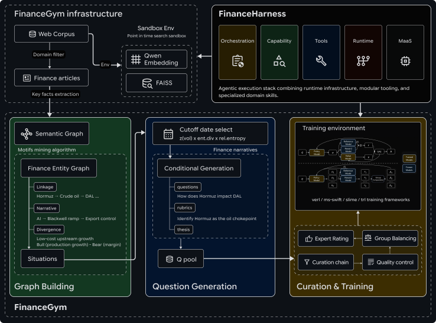
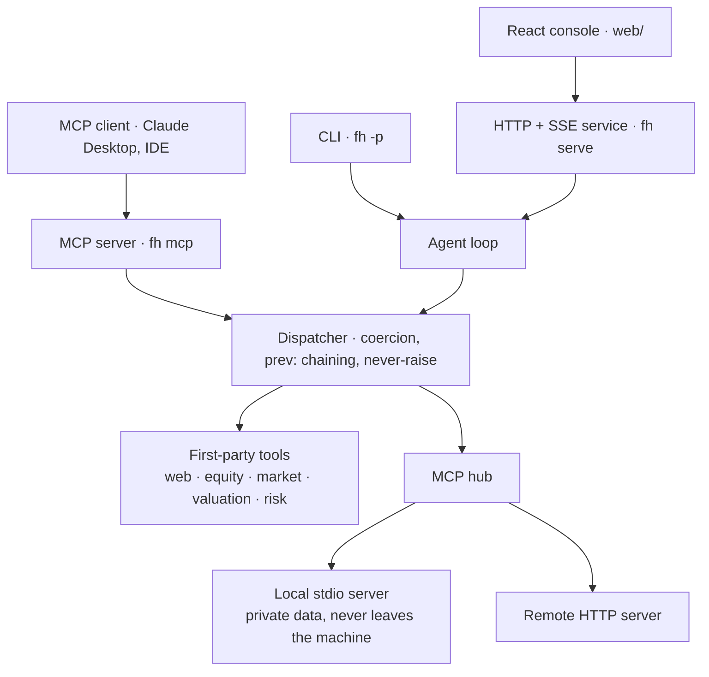

<p align="center">
  
</p>

<div align="center">
  <a href="https://www.readme-i18n.com/Yijia-Xiao/FinanceHarness?lang=de">Deutsch</a> | 
  <a href="https://www.readme-i18n.com/Yijia-Xiao/FinanceHarness?lang=es">Español</a> | 
  <a href="https://www.readme-i18n.com/Yijia-Xiao/FinanceHarness?lang=fr">français</a> | 
  <a href="https://www.readme-i18n.com/Yijia-Xiao/FinanceHarness?lang=ja">日本語</a> | 
  <a href="https://www.readme-i18n.com/Yijia-Xiao/FinanceHarness?lang=ko">한국어</a> | 
  <a href="https://www.readme-i18n.com/Yijia-Xiao/FinanceHarness?lang=pt">Português</a> | 
  <a href="https://www.readme-i18n.com/Yijia-Xiao/FinanceHarness?lang=ru">Русский</a> | 
  <a href="https://www.readme-i18n.com/Yijia-Xiao/FinanceHarness?lang=zh">中文</a>
</div>

---

# FinanceHarness: Autonomous Financial Deep Research Framework

<p align="center">
  <a href="https://arxiv.org/pdf/2607.27853">
    
  </a>
</p>

## Overview

**FinanceHarness is an autonomous financial deep research framework.** Ask a
question; FinanceHarness plans, gathers evidence, runs the analysis, and writes a
cited report.

- **Research and compute.** Web search and reading, company and market data, and
  valuation and risk computed from the gathered data, not guessed.
- **Reference-chaining.** One tool's output feeds the next by reference
  (`prev:<call_id>.<path>`), so a price series becomes a correlation with no
  retyping.
- **Progressive disclosure.** The core loop stays in the prompt; everything else
  waits in a catalog and loads on request, so breadth costs nothing until used —
  and a data provider exposing dozens of tools collapses to a single catalog
  line the agent searches.
- **Extensible without code.** A `SKILL.md` file composes existing tools into a
  reusable workflow. Drop one in and it is discovered.
- **Grounded.** Every figure traces back to the tool or source it came from.
- **Connected.** MCP in both directions: borrow tools from other MCP servers
  (including a local process holding private data), and serve this harness's own
  toolkit to any MCP client.
- **Watchable.** A React console streams the run — plan, tool calls, the data
  behind them, sources, and the report as it is written.

## How it fits together

Three ways in, two sources of tools. The agent loop is the same in every case,
and every tool call — first-party or borrowed — goes through one dispatcher, so
argument coercion, `prev:` chaining and error handling are identical.



(The figure above is the stack as published in the paper; it predates the web
console and the MCP layer shown here.)

## Get Started

### Prerequisites

FinanceHarness needs [`uv`](https://docs.astral.sh/uv/):

```bash
curl -LsSf https://astral.sh/uv/install.sh | sh
```

That is enough for the CLI, the service, and the MCP server. The [web
console](#web-console-react) additionally needs Node (`^20.19` or `>=22.12`, what
Vite 8 requires) and npm; nothing else in the project does.

`make help` lists every entry point.

### Install

```bash
git clone https://github.com/Yijia-Xiao/FinanceHarness.git
cd FinanceHarness
uv tool install .  # installs the `financeharness` command (alias `fh`)
```

From a source checkout, `uv sync` sets up the environment and
`uv run python main.py ...` (or `uv run fh ...`) runs the same CLI without
installing.

### Configure a backbone

Backbones are named by the provider or runtime that serves them. The default is
`gemini` (a cloud backbone that requires only an API key). Configure whichever
suits the machine you are on:

| Backbone | Serves | Infra | Needs |
|---|---|---|---|
| `gemini` | `gemini-3.6-flash` (Google) | cloud | `GEMINI_API_KEY` |
| `gpt` | `gpt-5.6` (OpenAI) | cloud | `OPENAI_API_KEY` |
| `openrouter` | any OpenRouter model (many vendors, one key) | cloud | `OPENROUTER_API_KEY` |
| `qwen` | Qwen (open-weight) | GPU server | a local vLLM stack |

```bash
export GEMINI_API_KEY=...      # makes the Google/Gemini backbone available
export OPENAI_API_KEY=...      # makes the OpenAI/GPT backbone available
export OPENROUTER_API_KEY=...  # makes the OpenRouter backbone available

# Or point at an OpenAI-compatible vLLM stack you serve yourself:
export FH_QWEN_BASE_URL=http://gpu-box:8000/v1
export FH_QWEN_READER_BASE_URL=http://gpu-box:8001/v1   # the long-document reader
```

Pick a backbone per run with `--profile NAME`, or change the default in
[`configs/providers.json`](configs/providers.json) (or via `FH_PROFILE`).

#### OpenRouter

`openrouter` reaches many vendors' models through one key over the same
OpenAI-compatible wire, so it needs no extra machinery — just a key and the
model slug you want to route to:

```bash
export OPENROUTER_API_KEY=...
export FH_OPENROUTER_MODEL=openai/gpt-5.1          # any `vendor/model` slug
fh -p "Estimate NVDA's intrinsic value with a DCF." --profile openrouter
```

Pin a slug (instead of exporting it per run) and add OpenRouter's routing
preferences in [`configs/providers.json`](configs/providers.json):

```json
{
  "profiles": {
    "openrouter": {
      "model": "anthropic/claude-sonnet-4.5",
      "extra_body": { "provider": { "order": ["anthropic"], "allow_fallbacks": false } }
    }
  }
}
```

Pick a slug that calls tools well — the loop is tool-driven, and a model without
reliable function calling will stall. The backbone reads its own pages, so no
local reader is required.

### Run

One-shot research. The cited report goes to stdout, progress to stderr, so
stdout stays pipeable:

```bash
fh -p "Estimate NVDA's intrinsic value with a DCF."
fh -p "Apple's competitive position in 2026?" --mode research
fh -p "..." --profile gpt --save run.json  # switch backbone; persist trajectory
echo "What's AAPL's P/E?" | fh -p          # question piped via stdin
fh --list                                  # backbones + skills; confirms the install
```

Options: `--mode {auto|research|analytical}`, `--profile NAME`, `--reader NAME`,
`--save PATH`, `--quiet`. Exit code is `0` when the agent produced an answer,
`1` otherwise.

Two sub-commands: `fh serve` (the HTTP+SSE service, and the React console when
built) and `fh mcp` (serve the harness to MCP clients). Both are covered below.

### Modes

Modes are prompt variants over a constant tool registry, so switching never
strands a trajectory. Set with `--mode`.

| Mode | Focus |
|---|---|
| `auto` | Full toolkit; the agent decides |
| `research` | Web-first deep research |
| `analytical` | Numbers-first: data and valuation tools, web for context |

A `-p` one-shot defaults to `research`.

## Tools

Seven tools are always visible; the rest sit in a catalog and are loaded on
demand with `load_tool`.

| Group | Tools |
|---|---|
| **Web research** | `search`, `visit`, `compose_citations` |
| **Core** | `calc`, `update_plan`, `load_tool`, `load_skill` |
| **Equity data** | `data_equity_reference`, `data_equity_prices`, `data_equity_fundamentals`, `data_equity_ratios`, `data_equity_comps`, `data_equity_estimates` |
| **Market data** | `data_market_rates`, `data_market_indices` |
| **Valuation** | `compute_valuation_dcf`, `compute_valuation_dcf_sensitivity`, `compute_valuation_wacc` |
| **Risk** | `compute_risk_correlation`, `compute_risk_var`, `compute_risk_beta` |
| **Cyber knowledge (RAG)** | `knowledge_cyber_search`, `knowledge_cyber_ingest`, `knowledge_cyber_status` |
| **MCP** (optional) | `mcp_<server>_<tool>` — anything a configured MCP server exposes |

Company and market data are sourced through `yfinance`; the cyber knowledge
tools retrieve from a local corpus — see
[Cyber knowledge corpus (RAG)](#cyber-knowledge-corpus-rag).

## Extend with skills

A **skill** is a `SKILL.md` (YAML frontmatter + a markdown body) that orchestrates
the existing tools into a reusable workflow, no code required. The model loads
one with `load_skill` when it fits the task. Bundled:

| Skill | What it does |
|---|---|
| `ticker-snapshot` | Quick structured overview of one equity (identity, ratios, price/trend). |
| `dcf-valuation` | Intrinsic value via DCF: fundamentals → CAPM/WACC → project and discount. |
| `relative-valuation` | Peer-median multiples applied to the company for an implied range. |
| `consensus-check` | Sell-side view (targets, estimates, ratings) corroborated against the web. |
| `equity-deep-dive` | The full workflow: qualitative picture + fundamentals + DCF + comps + consensus. |
| `cyber-threat-brief` | Grounded security brief: exploitation status, ATT&CK mapping, affected versions, mitigations. |

Discovery runs in increasing precedence: bundled `financeharness/skills/` → a
project `./skills/` → `FH_SKILLS_DIR`. A project skill overrides a built-in by
name, and a malformed one is skipped rather than fatal.

## Cyber knowledge corpus (RAG)

A retrieval subsystem that ingests cyber-security knowledge from the internet
into a local SQLite corpus and returns ranked passages **with their source
URLs**, so a claim retrieved from it carries a `[N]` citation exactly like a page
the agent visited.

```bash
fh rag ingest                    # MITRE ATT&CK + CISA KEV + OWASP + CISA best practices
fh rag status                    # what the corpus holds
fh rag query "how is LSASS credential dumping detected" -k 5
fh rag ingest web --query "kubernetes rbac hardening"   # anything else on the internet
```

Ingestable sources (`fh rag sources`): **MITRE ATT&CK** (the full STIX bundle —
techniques, tactics, groups, software, mitigations), **CISA KEV** (CVEs with
confirmed in-the-wild exploitation), **[CISA cybersecurity best
practices](https://www.cisa.gov/topics/cybersecurity-best-practices)**, **NVD**
CVE records, the **OWASP** Cheat Sheet Series, seven security **news/research
feeds**, plus **open web search** and **explicit URLs** — the curated feeds are a
high-signal floor, not a ceiling.

Retrieval is hybrid: BM25 finds `CVE-2021-44228` because the string is there,
vector search finds the persistence technique when the question says "keep access
after a reboot", and the two ranked lists are fused with Reciprocal Rank Fusion.
Embeddings are optional — with none configured it runs lexical-only, no
credentials and no network. The agent reaches the same corpus through three
deferred tools (`knowledge.cyber.search` / `.ingest` / `.status`) and the
`cyber-threat-brief` skill.

Full documentation: [`financeharness/rag/README.md`](financeharness/rag/README.md).

## Web console (React)

`web/` is a React console over the service: one question at a time, streamed. It
shows the plan as the agent maintains it, every tool call with the data that came
back, the sources filling as pages are read, and the report as it is written —
so the evidence sits next to the answer instead of behind it.

```bash
make install web-install      # Python env + npm install
make serve                    # the API on :8080  (terminal 1)
make web                      # the console on :5173 (terminal 2)
```

The dev server proxies `/api` to the service, so the console talks to one origin
(`FH_API_URL` retargets the backend). For a single process, build it once and let
the service serve it:

```bash
make app        # web-build + serve → API and UI together on :8080
```

What the console gives you beyond the CLI: the live trace (rounds, tool
arguments, the grounding data behind each figure), the sources rail numbered to
match the report's `[N]` markers, the scoping dialog when a question is
genuinely ambiguous, multi-turn sessions with a context meter and one-click
compaction, a backbone picker, markdown/trajectory export, and a panel showing
which MCP data sources this run can reach.

### HTTP + SSE service

The service is useful on its own — for a remote client, an eval harness, or
anything programmatic:

```bash
fh serve  # HTTP+SSE on 127.0.0.1:8080
```

| Endpoint | Purpose |
|---|---|
| `POST /research` | run a trajectory; sync JSON, or SSE with `stream=true` |
| `POST /clarify` | scope a question before researching (fail-open) |
| `POST /compact` | summarize a session's older turns to free context |
| `GET /models` | backbones + credential availability |
| `GET /mcp` | configured MCP servers (`?probe=true` dials them) |
| `GET /sessions`, `/sessions/{id}`, `/status`, `/health` | session + readiness |

The SSE frame protocol is documented in
[`financeharness/service/events.py`](financeharness/service/events.py), and the
running service serves its own OpenAPI schema at `/openapi.json` with an
interactive reference at `/docs`.

## MCP integration

The harness speaks the [Model Context Protocol](https://modelcontextprotocol.io)
in both directions.

### Borrow tools from other MCP servers (inbound)

Configure a server in [`configs/mcp.json`](configs/mcp.json) and its tools join
every run's catalog, in the deferred tier — the agent sees them alongside the
first-party tools and loads what the question needs. Its resources (files,
tables, documents) are bridged too, as a list/read pair, so a source with no
tools of its own is still readable.

Two transports:

| Transport | Config | For |
|---|---|---|
| stdio | `command` + `args` | a local process — **private data that never leaves the machine** |
| http | `url` + `headers` | a streamable-HTTP MCP endpoint, local or remote |

```json
{
  "servers": {
    "portfolio": {
      "command": "uv",
      "args": ["run", "python", "examples/mcp/local_portfolio.py"]
    },
    "eodhd": {
      "url": "https://mcp.eodhd.com/v1/mcp?apikey=${EODHD_API_KEY}"
    },
    "internal-api": {
      "url": "https://mcp.internal.example.com/mcp",
      "headers": { "Authorization": "Bearer ${INTERNAL_MCP_TOKEN}" },
      "tools": ["lookup_customer"]
    }
  }
}
```

`${VAR}` is expanded from the environment, so tokens stay out of the file.
`tools` is an optional allowlist. A server that won't connect is reported and
skipped — the run keeps every tool it does have. `FH_MCP_DISABLE=1` turns the
integration off; `FH_MCP_CONFIG` points at a different file.

Server identity travels with the run — into the UI, the API, and any saved
trajectory — so credentials are stripped from it: a URL displays as
`…/mcp?apikey=***`, and userinfo as `https://***@host`. Many MCP endpoints carry
their key in the query string, and a trajectory is a file you might share.

#### Prompt cost of a large server

A real data provider can expose 90+ tools, and one catalog line each would price
its whole surface into every model call — the thing the deferred tier exists to
avoid. Past `catalog_threshold` (12) tools, a server collapses to a single
catalog entry listing its tool *names*, plus a `find_tools` search; the model
narrows, `load_tool`s the schemas it wants, and calls them. Same progressive
disclosure the first-party tools use, one level up.

Measured on EODHD's MCP server (91 tools), system prompt per model call:

| | Tokens |
|---|---|
| harness alone | 3,146 |
| + 91 tools catalogued individually | 24,037 |
| + 91 tools indexed (the default) | 3,973 |

Force it either way with `"catalog": "full" | "index"` per server.

[`examples/mcp/local_portfolio.py`](examples/mcp/local_portfolio.py) is a working
local data source — a CSV of holdings exposed as three tools and a resource.
Enable the `portfolio` entry in `configs/mcp.json` and ask a question only your
own data can answer:

```bash
fh -p "Given my holdings, what is my concentration risk in semis?"
```

Borrowed tools appear as `mcp_<server>_<tool>` in the trace, so a trajectory
always says which figures came from outside the harness.

### Serve the harness to MCP clients (outbound)

`fh mcp` exposes the harness over MCP: every data, valuation, risk and research
tool with its real schema, the bundled skills as prompts *and* resources, and a
`deep_research` tool that runs the whole loop and returns a cited report.

```bash
fh mcp                          # stdio — what an MCP host spawns
fh mcp --http --port 8765       # streamable HTTP, for a remote client
fh mcp --list                   # what would be exposed, no client needed
```

For Claude Desktop (or any MCP client), point it at the checkout:

```json
{
  "mcpServers": {
    "financeharness": {
      "command": "uv",
      "args": ["run", "--directory", "/path/to/FinanceHarness", "fh", "mcp"],
      "env": { "GEMINI_API_KEY": "..." }
    }
  }
}
```

Calls route through the harness dispatcher, so an MCP client inherits the same
argument coercion, the same actionable error text, and the same reference
chaining a first-party run gets: every result carries a `call_id`, and
`prev:<call_id>.<path>` feeds one tool's output into the next without the client
ever holding the numbers.

```
data_equity_prices(ticker="AAPL", period="3mo")   → call_1
compute_risk_var(prices="prev:call_1.bars[*].close", confidence=0.95)
```

The data and compute tools need no API key at all — only `visit` and
`deep_research` call a model.

## Reference

### Repository layout

```
financeharness/
  cli.py         the `fh` / `financeharness` entry point: research, serve, mcp
  research.py    one-shot entry point — assemble the harness, run a trajectory
  clarify.py     the pre-research scoping pass
  runtime/       agent loop, never-raise dispatch, registries, chaining, recovery
  providers/     backbone seam (native Gemini + any OpenAI-compatible endpoint)
  tools/         research (search/visit/cite) + equity/market data + valuation/risk
                 + knowledge/ (the cyber RAG tools)
  rag/           cyber-security retrieval corpus: sources, chunking, store, retrieval
  skills/        bundled SKILL.md workflow recipes
  mcp/           MCP both ways — hub (borrow tools), server (serve the harness)
  service/       FastAPI HTTP+SSE service; also serves web/dist when built
web/             the React console (Vite); src/useRun.js folds the SSE protocol
configs/         providers.json · runtime.json · mcp.json
examples/mcp/    a local MCP data source you can actually run
```

### Environment variables

Nothing here is required — every one of these overrides a default, and the
defaults work. Config precedence throughout is *built-in defaults < JSON file <
environment*.

**Credentials** — a backbone becomes available when its key is set.

| Variable | Effect |
|---|---|
| `GEMINI_API_KEY` | enables the `gemini` backbone (the default) |
| `OPENAI_API_KEY` | enables the `gpt` backbone |
| `OPENROUTER_API_KEY` | enables the `openrouter` backbone (many vendors, one key) |

**Backbone selection** — see [`configs/providers.json`](configs/providers.json).

| Variable | Effect |
|---|---|
| `FH_PROFILE` | the default backbone (else the file's `default`, else `gemini`) |
| `FH_<NAME>_BASE_URL` | override one profile's endpoint, e.g. `FH_QWEN_BASE_URL` |
| `FH_<NAME>_MODEL` | override one profile's model id, e.g. `FH_OPENROUTER_MODEL` |

**MCP** — see [`configs/mcp.json`](configs/mcp.json).

| Variable | Effect |
|---|---|
| `FH_MCP_CONFIG` | use a different MCP config file |
| `FH_MCP_DISABLE` | `1` turns the whole external-MCP integration off |

**Runtime limits** — anti-runaway backstops, not a quality budget. See
[`configs/runtime.json`](configs/runtime.json).

| Variable | Effect |
|---|---|
| `MAX_TOKENS` | starting output budget per model call (the loop may escalate) |
| `PER_CALL_TIMEOUT_S` | hard timeout on one model call |
| `MAX_RUN_DURATION_S` | wall-clock cap for a whole run |
| `MAX_LLM_CALL_PER_RUN` | maximum agent rounds |
| `CONTEXT_WINDOW` | the window compaction budgets against |

**Cyber RAG corpus** — see
[`financeharness/rag/README.md`](financeharness/rag/README.md).

| Variable | Effect |
|---|---|
| `FH_RAG_DB` | corpus location (default `~/.financeharness/rag/cyber.sqlite3`) |
| `FH_RAG_EMBED_MODEL` | set to enable vector search (else lexical BM25 only) |
| `FH_RAG_EMBED_BASE_URL` | embeddings endpoint (default OpenAI; any compatible one works) |
| `FH_RAG_EMBED_API_KEY_ENV` | env var holding the embeddings credential |
| `FH_RAG_TOP_K` | passages returned per query (default 6) |
| `FH_RAG_CHUNK_CHARS` / `FH_RAG_CHUNK_OVERLAP` | passage geometry (default 1200 / 200) |
| `NVD_API_KEY` | raises the NVD ingest rate limit |

**Paths and the console**

| Variable | Effect |
|---|---|
| `FH_SKILLS_DIR` | extra skill roots (`os.pathsep`-separated), highest precedence |
| `FH_SESSIONS_DIR` | where the service stores sessions (default `~/.financeharness/sessions`) |
| `FH_PORTFOLIO_CSV` | holdings file for the bundled example MCP server |
| `FH_API_URL` | backend the console's **dev** server proxies to (default `http://127.0.0.1:8080`) |
| `VITE_API_BASE` | API base baked into a console **build** (default: same origin) |

## Benchmark

The **FinanceGym** benchmark and leaderboard are maintained at
[google-research/finance_harness](https://github.com/google-research/google-research/tree/master/finance_harness).

## Citation

If you find *FinanceHarness* helpful, please cite our work.

```bibtex
@misc{xiao2026financeharnessautonomousfinancialdeep,
      title={FinanceHarness: Autonomous Financial Deep Research Framework}, 
      author={Yijia Xiao and Rujun Han and Yanfei Chen and Zifeng Wang and Ke Jiang and Zhongying CuiZhu and Vishy Tirumalashetty and Wei Wang and Burak Gokturk and Tomas Pfister and Chen-Yu Lee},
      year={2026},
      eprint={2607.27853},
      archivePrefix={arXiv},
      primaryClass={cs.CL},
      url={https://arxiv.org/abs/2607.27853}, 
}
```
